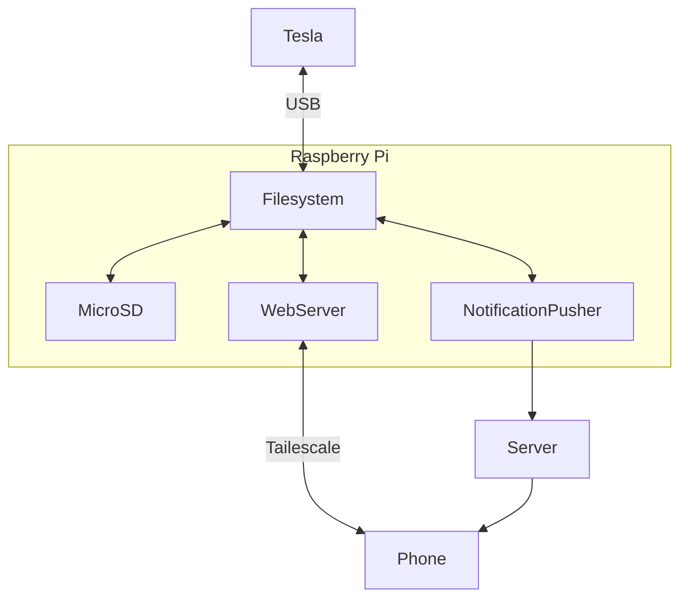

SentryBox for Tesla
---

Tesla's remote sentry mode clips is not available in certain
countries.

The SentryBox allows you to remotely view your Sentry events and live
footage through a web interface at any time.

# Features
- [x] Remote Viewing: Access Tesla Sentry mode recordings and
      real-time video from anywhere.
- [ ] Notifications: Send you notifications with video clip links when
      a Sentry event occurs.
- [ ] Lock Sound: Update the car's lock sound through a web interface.
- [ ] Musics: Upload musics to the car from a web interface.

# Architecture



# How to use this project
## Prerequisites
- A Raspberry Pi Zero 2W with:
    1) A SD card(128G recommended)
    2) A USB-A to microUSB cable
- A computer running NixOS

## Steps to use SentryBox
1. Build the raspberry pi system image and write it to the sd card
2. Plug the pi onto the usb inside the Tesla's glove box
3. Access the web interface at `http://<the-pi-ip>:8000`
4. Optionally, you can setup the tailscale to access from any network

# Building the system image
Before building the image, the cross compilation must be enabled, add
the following config to your `configuration.nix` and run
`nixos-rebuild switch`.

```
boot.binfmt.emulatedSystems = [ "aarch64-linux" ];
```

1. Update configs:
  - `config/wifi.nix`: add your home wifi or mobile hotspot used on car
  - `config/ssh-keys.nix`: add an admin user to connect through ssh

2. Build the image

    ```sh
    nix build -L .#images.zero2w
    ```

3. Copy the image to the pi's sd card

    ```sh
    DEVICE=/dev/disk5 # Whatever your sd card reader is
    sudo dd if=result/sd-image/zero2.img of=$DEVICE bs=1M conv=fsync status=progress
    ```

# Remote Updating
After initially building the system image and booting the Pi, you can
remotely update the system without needing to rebuild the image or
remove the SD card.

1. Boot the pi and get its ip address from:
    1) your router's admin panel
    2) OR if you have a mini-HDMI cabel, connect a monitor and
    keyboard to the pi and run the command:

        ```sh
        ifconfig wlan0
        ```

2. Update the pi from your NixOS:

    ```sh
    ZERO2_IP=<the-zero2-ip>
    SSH_USER=<the-admin-user-in-the-pi>
    nixos-rebuild switch --target-host $SSH_USER@$ZERO2_IP --flake .#zero2w --use-remote-sudo
    ```

# References
- [teslausb](https://github.com/marcone/teslausb)
- [rpi image reference 1](https://github.com/plmercereau/nixos-pi-zero-2)
- [rpi image reference 2](https://github.com/MatthewCroughan/raspberrypi-nixos-example)
